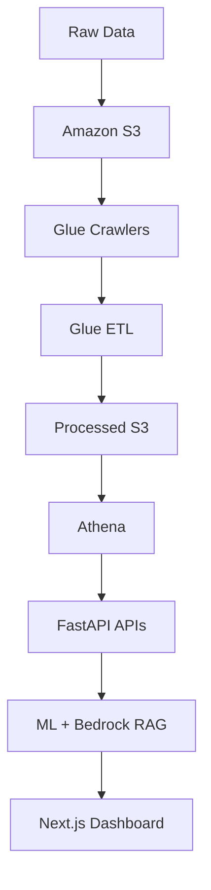

# InsightPilot AI

### End-to-End AI-Powered Customer Analytics Platform on AWS

*Data Engineering · Machine Learning · Generative AI · Real-Time Streaming*

---

## 📌 Overview

**InsightPilot AI** helps businesses analyze customer behavior, predict churn, answer natural-language business questions, and monitor real-time customer events — all in one production-style platform.

The project demonstrates a full AI system built on AWS cloud infrastructure, combining **FastAPI**, **Next.js**, **machine learning**, **Retrieval-Augmented Generation (RAG)**, and **streaming analytics** into a single cohesive pipeline.

---

## ✨ Features

| Capability | Description |
|---|---|
| 📉 **Churn Prediction** | XGBoost model forecasts customer churn risk |
| 🤖 **AI Business Assistant** | Natural-language Q&A powered by Amazon Bedrock |
| 🔍 **RAG Pipeline** | Retrieval-Augmented Generation over company documentation |
| ⚡ **Real-Time Streaming** | Live customer event ingestion via Amazon Kinesis |
| 🔄 **Automated ETL** | AWS Glue jobs handle transformation at scale |
| 🗃️ **SQL Analytics** | Serverless querying via Amazon Athena |
| 🚀 **FastAPI Backend** | High-performance REST APIs |
| 🖥️ **Next.js Dashboard** | Modern, responsive frontend |
| ✅ **Data Quality Validation** | Automated checks across the pipeline |
| 📊 **CloudWatch Monitoring** | Full observability into system health |
| 🧬 **SageMaker Integration** | Managed model training and deployment |

---

## 🏗️ Architecture

---

## 🔄 Project Workflow

---

## 🧰 Tech Stack

<table>
<tr>
<td valign="top" width="33%">

**Languages**
- Python
- SQL
- TypeScript

**Backend**
- FastAPI
- Pydantic
- LangChain
- LangGraph

</td>
<td valign="top" width="33%">

**Machine Learning**
- Scikit-Learn
- XGBoost
- SageMaker

**Generative AI**
- Amazon Bedrock
- Claude
- RAG
- LangChain

</td>
<td valign="top" width="33%">

**Frontend**
- Next.js
- React
- Tailwind CSS

**AWS**
- S3 · Glue · Athena
- Bedrock · SageMaker
- Lambda · Kinesis
- CloudWatch · IAM

</td>
</tr>
</table>

---

## 🔌 APIs

| Endpoint Group | Purpose |
|---|---|
| `Analytics API` | Aggregated customer and business metrics |
| `Churn Prediction API` | Real-time churn scoring |
| `RAG Chat API` | Natural-language business Q&A |
| `Streaming API` | Live event ingestion and monitoring |
| `Health API` | Service health checks |

---

## 🤖 Machine Learning

**Model:** XGBoost
**Prediction Target:** Customer Churn

**Features used:**
- Lifetime Revenue
- Purchase Frequency
- Average Order Value
- Customer Lifetime
- Days Since Last Order

---

## 💬 AI Assistant

The AI assistant uses an **Amazon Bedrock Knowledge Base** with **Retrieval-Augmented Generation** to answer business questions grounded in company documentation — no hallucinated answers, just retrieval-backed responses.

---

## 🛣️ Roadmap

- [ ] Docker deployment
- [ ] CI/CD pipeline
- [ ] ECS deployment
- [ ] Cognito authentication
- [ ] Auto scaling

---

## 👩‍💻 Author

**Vaishnavi Bhamare**
MS Advanced Data Analytics · University of North Texas

